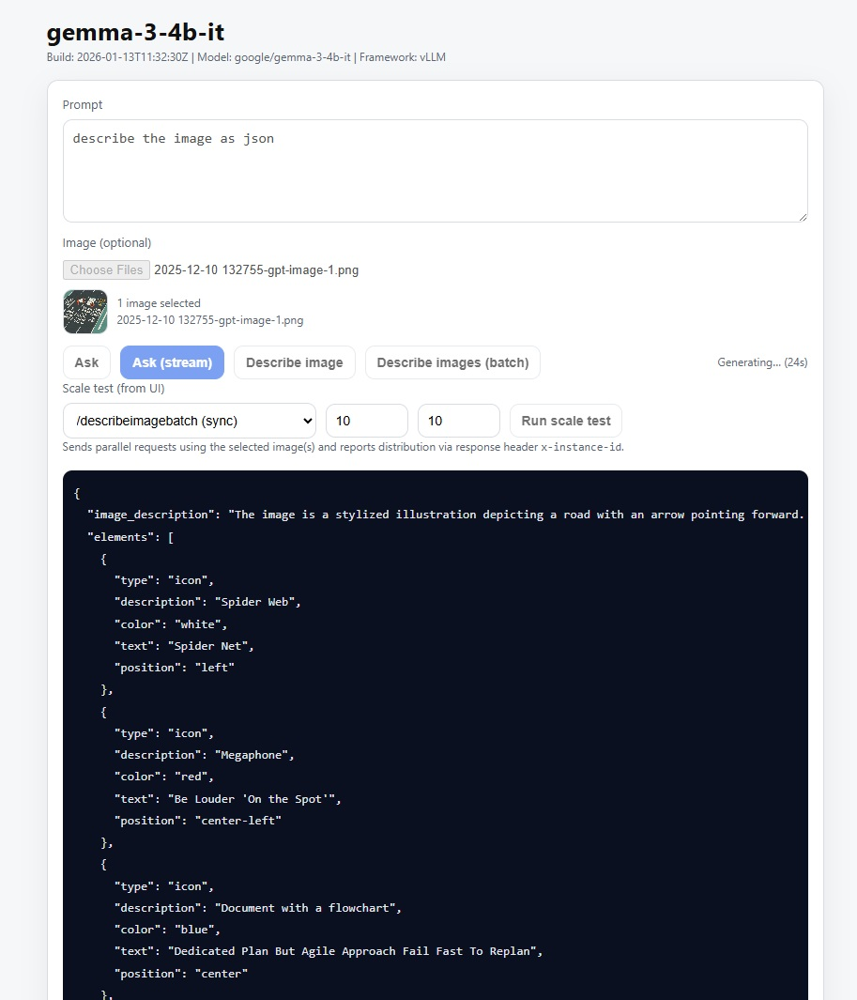

# 🤖 gemma-3-4b-it GPU-Accelerated LLM Hosting

Production-ready hosting for **Google's `google/gemma-3-4b-it `[HuggingFace](https://huggingface.co/google/gemma-3-4b-it)** on **Azure Container Apps (ACA) GPU Serverless** (NVIDIA A100-class GPUs) with [vLLM](https://docs.vllm.ai/en/latest/) and Transformers. Includes a FastAPI backend, streaming responses, and a simple web UI.



## 🎯 Overview

This repository provides a complete stack for serving Gemma 3 with:
- **FastAPI backend** with streaming response support
- **GPU-accelerated inference** using **vLLM** (text endpoints) and **Transformers** (multimodal image+text endpoints)
- **Modern web interface** with real-time streaming responses
- **Azure Container Apps deployment** with GPU workload profiles (A100)
- **Docker containerization** with NVIDIA CUDA base images

## ✨ Key Features

- 🚀 **GPU Acceleration**: Runs on ACA GPU Serverless (A100)
- 📦 **HuggingFace Integration**: Downloads `google/gemma-3-4b-it` during image build
- 🔄 **Streaming Responses**: Token streaming over NDJSON (`/predictstream`)
- 🖼️ **Image + Text**: Single and batch image description endpoints
- 📈 **Scale Testing**: UI can run parallel requests and report replica distribution via `x-instance-id`
- ☁️ **Azure Deployment**: Infrastructure as Code with Bicep templates + a PowerShell deployment script

## 🧠 Model Information

This project uses **Google Gemma 3 4B Instruct** from HuggingFace:
- Model: `google/gemma-3-4b-it`
- Typical access requirement: you must accept the model terms on HuggingFace before downloading

## ☁️ Azure Container Apps GPU (A100) Notes

This repo is designed to run on **Azure Container Apps GPU Serverless** using an **NVIDIA A100** workload profile (example in this repo: `NC24-A100`).

Hardware characteristics you should expect for the **A100 serverless GPU host**:
- **CPU / RAM (host capacity)**: up to **24 vCores** and **220 GB** memory
- **GPU memory**: **80 GB HBM2/HBM2e** per GPU
- **GPU count**: up to **4 GPUs** available (profile/SKU/region dependent)

Important: your **container** still requests its own CPU/memory in the Container App definition (see `cpuCores` / `memorySize` parameters). The host capacity above reflects the underlying GPU server class.

## 🏗️ Architecture

```
┌─────────────────────┐
│     Web Browser     │
│   web/index.html    │
└─────────┬───────────┘
          │ HTTP
          ▼
┌─────────────────────┐
│     FastAPI API     │
│       app.py        │
├─────────┬───────────┤
│  Text   │  Vision    │
│  vLLM   │ Transformers│
└─────────┴───────────┘
          │ CUDA
          ▼
┌─────────────────────┐
│ NVIDIA A100 GPU(s)  │
└─────────────────────┘
```

## 🚀 Quick Start

### Prerequisites

**Important:** Before downloading the gemma-3-4b-it model, you must:
1. Create a HuggingFace account at https://huggingface.co
2. Visit the model page: https://huggingface.co/google/gemma-3-4b-it
3. Accept the terms and conditions directly on the HuggingFace portal
4. Login to HuggingFace CLI: `hf auth login`

Without accepting the terms, you'll get access errors when attempting to download the model.

### Local Development

This project is primarily optimized for running **in the container**, where the model is downloaded to `/app/models/gemma-3-4b-it` during the Docker build. If you want to run locally without Docker, you can:

- Use Docker Desktop (recommended), or
- Modify the model path in `app.py` to point at your local model directory.

```bash
# Install dependencies
pip install -r requirements.txt

# Login to HuggingFace (required for Gemma models)
hf auth login

# Download the model
hf download google/gemma-3-4b-it --local-dir ./models/gemma-3-4b-it

# Run the server
uvicorn app:app --reload --host 0.0.0.0 --port 5000
```

Visit `http://localhost:5000/static/index.html`

### Docker Build (GPU-enabled)

```bash
# Build the image
docker build -t gemma-3-4b-gpu .

# Run with GPU support
docker run --gpus all -p 5000:5000 gemma-3-4b-gpu
```

## ☁️ Azure Deployment

### Prerequisites

- Azure subscription
- Azure CLI installed and logged in
- Azure Container Registry (ACR)

HuggingFace (required to download the model during the container build):
- Register / log in at https://huggingface.co
- Visit https://huggingface.co/google/gemma-3-4b-it and accept the terms
- Create an access token and set it as `HF_TOKEN`

### Recommended: run the deployment script

The canonical deployment flow is [deployment.ps1](deployment.ps1). It deploys infra (Bicep), builds the image in ACR, recreates the Container App with the GPU workload profile, and assigns `AcrPull`.

Before running it, set your HuggingFace token (used during `az acr build`):

```powershell
$env:HF_TOKEN = "<your_huggingface_token>"
./deployment.ps1
```

### Deployment Steps (high level)

1. **Build and push Docker image**:
   ```powershell
   az acr build --registry <your-acr-name> --image gemma-3-4b-gpu:latest .
   ```

2. **Create GPU-enabled Container Apps environment**:
   ```powershell
   az containerapp env create `
     --name me-gpullm `
     --resource-group GPU.LLM.RG `
     --location eastus `
     --enable-workload-profiles
   
   az containerapp env workload-profile add `
     --name me-gpullm `
     --resource-group GPU.LLM.RG `
     --workload-profile-name NC24-A100 `
     --workload-profile-type NC24-A100
   ```

3. **Deploy the container app**:
   ```powershell
   az containerapp create `
     --name gemma-3-4b-gpu `
     --resource-group GPU.LLM.RG `
     --image <your-acr>.azurecr.io/gemma-3-4b-gpu:latest `
     --cpu 4 --memory 8Gi `
     --environment me-gpullm `
     --registry-server <your-acr>.azurecr.io `
     --ingress 'external' --target-port 5000 `
     --workload-profile-name NC24-A100 `
     --env-vars CUDA_VISIBLE_DEVICES=0 NVIDIA_VISIBLE_DEVICES=all `
     --min-replicas 1 --max-replicas 2 `
     --system-assigned
   ```

See `DEPLOYMENT.md` for detailed deployment instructions.

## 📁 Project Structure

```
gemma-3-4b/
├── app.py                  # FastAPI application
├── requirements.txt        # Python dependencies
├── dockerfile             # Multi-stage Docker build
├── deployment.ps1         # Azure deployment script
├── web/
│   ├── index.html         # Web interface
│   ├── ollama.js          # Streaming response handler
│   ├── style.css          # UI styling
│   └── showdown.min.js    # Markdown renderer
└── infra/
    ├── main.bicep         # Azure infrastructure
    └── main.parameters.json
```

## 🔌 API Endpoints

### `POST /predict`
Generate a complete response

### `POST /predictstream`
Generate streaming response (recommended)

### `POST /describeimage`
Describe a single image (multipart form upload)

### `POST /describeimagestream`
Describe a single image with streaming output

### `POST /describeimagebatch`
Describe multiple images in one request

### `POST /describeimagebatchstream`
Describe multiple images with streaming output

### `GET /health`
Health check endpoint

### `GET /buildinfo`
Build metadata (includes model + framework)

### `GET /static/index.html`
Web interface

## 🎨 Web Interface Features

- **Real-time streaming**: See responses as they're generated
- **Markdown rendering**: Properly formatted code blocks and text
- **Auto-clear input**: Question field clears after each response
- **Keyboard shortcut**: Press Enter to submit

## 🔐 Environment Variables

- `CUDA_VISIBLE_DEVICES`: GPU device IDs to use
- `NVIDIA_VISIBLE_DEVICES`: NVIDIA device visibility
- `NVIDIA_DRIVER_CAPABILITIES`: Driver capabilities (compute, utility)

vLLM tuning (read by `app.py`):
- `VLLM_GPU_MEMORY_UTILIZATION` (default `0.6`)
- `VLLM_MAX_MODEL_LEN` (default `4096`)
- `VLLM_MAX_TOKENS` (default `2048`)
- `VLLM_ENFORCE_EAGER` (default `true`)

Misc:
- `BUILD_TIME` (shown in the UI)
- `GEMMA_MODEL_PATH` (used by the Transformers vision loader; defaults to `/app/models/gemma-3-4b-it`)

## 📊 Performance & Scaling Notes

- **Cold starts**: first request after scale-to-zero (or replica spin-up) will be slower; keep `minReplicas` > 0 if you need consistent latency.
- **Scale testing**: the UI can run parallel requests and shows which replica served each request using the `x-instance-id` header.
- **Multi-GPU**: the code is configured with `tensor_parallel_size=1` today. If you deploy a profile with multiple GPUs, you can increase tensor parallelism (and validate memory/throughput) accordingly.

### ACA scaling test


## 🛠️ Customization

### Using a Different HuggingFace Model

1. Update [dockerfile](dockerfile) to download your model into `/app/models/<your-model-dir>`.
2. Update the `model=` path used by vLLM in `app.py`.
3. For private/gated models, pass your HuggingFace token during build (the Dockerfile supports `HF_TOKEN`).

### Styling the Web Interface

Modify `web/style.css` to customize the UI appearance.

## 📝 License

This project is provided as-is for educational and development purposes.

## 🤝 Contributing

Feel free to submit issues and enhancement requests!

## 📚 Resources

- [Google Gemma 3 (HuggingFace)](https://huggingface.co/google/gemma-3-4b-it)
- [vLLM](https://docs.vllm.ai/)
- [Transformers](https://huggingface.co/docs/transformers/index)
- [Azure Container Apps](https://learn.microsoft.com/azure/container-apps/)
- [HuggingFace Hub](https://huggingface.co/docs/hub/index)

---

**Note**: This solution is a good starting point for hosting your own fine-tuned (HF) models on ACA GPU Serverless. Replace the model download + model path, rebuild, and redeploy.
